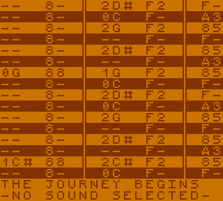

# gbdk-music
Music library for gbdk-n with demo music player.



## Build

Dependencies:
* [sdcc](https://sourceforge.net/projects/sdcc/) must be installed
* [gbdk-n](https://github.com/andreasjhkarlsson/gbdk-n) must be cloned in dev/

Get ready:
```
#pacman -S vbam-sdl sdcc
cd dev
git clone https://github.com/andreasjhkarlsson/gbdk-n
cd gbdk-n
make
cd ../../
```

Build music:
```
make
```

## Play

Dependencies:
* [vbam](https://github.com/visualboyadvance-m/visualboyadvance-m) or another emulator must be installed

Build and play music:
```
make playmusic
```

# How

I tried to make the notation tracker-like.

`const Song_frame song[]` just defines which patterns are played when.
Each pattern consists of multiple `Pattern_frame`s

`pulse_note` and `wave_note` have values like `0x20 | note_d`. This is the note D on the second octave. `0xFF` is a NOP

`pulse_vi`, `wave_vi` and `noise_vi` have values like `0xD6`. The left number is the volume and the right number is the instrument. `0x?F` keeps the instrument untouched.

-------
An example song can be found at [music/the_journey_begins.c](music/the_journey_begins.c)

-------

The first pulse wave generator does not get used, so it can be used for sound effects.